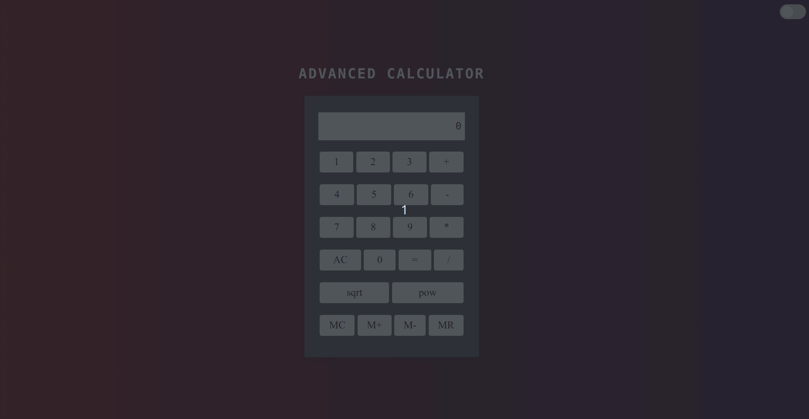

# Advanced Calculator DOM Widget

## Description

The **Advanced Calculator Widget** is an interactive tool built with HTML, CSS, and JavaScript. This widget offers standard arithmetic operations and several advanced functionalities, all presented within an intuitive user interface. Users can also toggle between light and dark themes for enhanced usability.

## Features

- **Standard Arithmetic Operations**: Perform addition, subtraction, multiplication, and division.
- **Advanced Functionalities**: Use advanced functions like square root and power.
- **Memory Operations**: Store, retrieve, and manipulate numbers in memory with operations like MC (Memory Clear), M+ (Memory Add), M- (Memory Subtract), and MR (Memory Recall).
- **Dynamic UI**: The calculator buttons and display are dynamically generated using JavaScript.
- **Dark Mode**: Toggle between light and dark themes for improved visibility in various lighting conditions.

## JavaScript Techniques

- **DOM Manipulation**: The script makes extensive use of `document.querySelector()` and `document.createElement()` for dynamic creation and manipulation of the calculator's UI elements.
- **Event Handling**: Event listeners are used for button clicks, dark mode toggling, and document loading.
- **Array Iteration**: The `keys` array, which defines the calculator buttons, is iteratively processed to generate the calculator's UI.
- **Dynamic Styling**: Conditional CSS class toggling is used to implement the dark mode feature.
